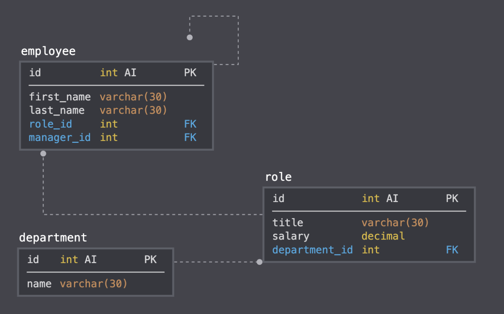

# Fitness-tracker (HWK17)


Watch the video walk through [here](https://drive.google.com/file/d/13pHzseW7KST2NLXlXtgJA2tgWBkndWs6/view)


View the [Employee-Tracker Github page](https://github.com/suzylebel/employee-tracker)


## Table of Contents
1. [User story](#User-story)
2. [About the Project](#About-the-Project)
3. [Tech/Framework used](#Tech-Used)
4. [Code Breakdown](Code-Breakdown)
5. [License](#License)
6. [Contact](#Contact)
7. [Credits](#Credit)

## User Story


```
As a business owner
I want to be able to view and manage the departments, roles, and employees in my company
So that I can organize and plan my business
```


## About the Project

The goal was to make a databse schema under these terms


Explore the [Deployed Employee Tracker on Github](https://github.com/suzylebel/employee-tracker))

This node.js application is for tracking your employee's in a directory so you can track their salary, managers, and roles!


## Tech Used
Node.js   mySQL

## Code Breakdown

This backend application was built from scratch and using SQL to track the employees in a database when they are updated etc.

## Contribute
If you’d like to fork this project from github please feel free! With a pull request I can grant you access to leave comments and notes about this project. 

## License 
None
 
## Contact 

Suzy Le Bel 
suzy.lebel@gmail.com
[Visit my Github Page](https://github.com/suzylebel/)


## Credit


